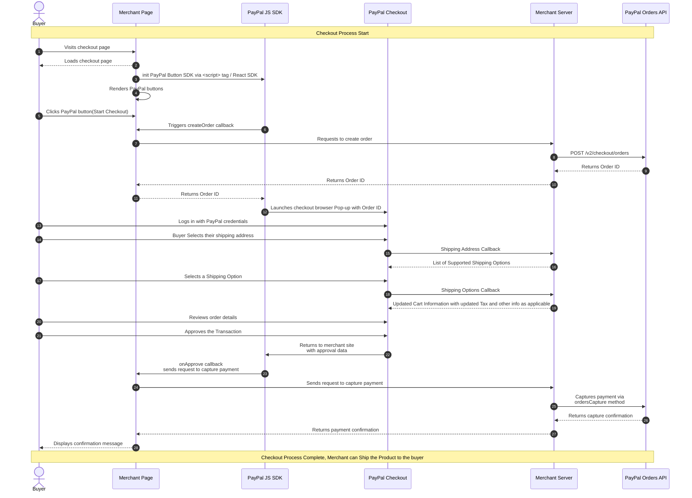

PayPal Checkout Integration Server Api Implementation (paypal-checkout-example-server)
=====

> [!NOTE]  
> This project has been forked from [paypal-examples/paypal-sdk-server-side-integration](https://github.com/paypal-examples/paypal-sdk-server-side-integration).

Node.js web server for testing a PayPal JS SDK and REST API integration. Built with the [Fastify web framework](https://www.fastify.io/).

## Quick Start

Copy `example.env` to a new file named `.env` in this project's root directory and add your API credentials to it. This will securely pass them and other config options to the Node.js web server as environment variables at runtime. The `.env` file with your credentials should _never_ be checked into git version control.

This application requires Node.js version 20 or higher. Please ensure you have installed and enabled the correct version.

Then install dependencies and start the local web server:

```bash
npm install
npm run dev
```

